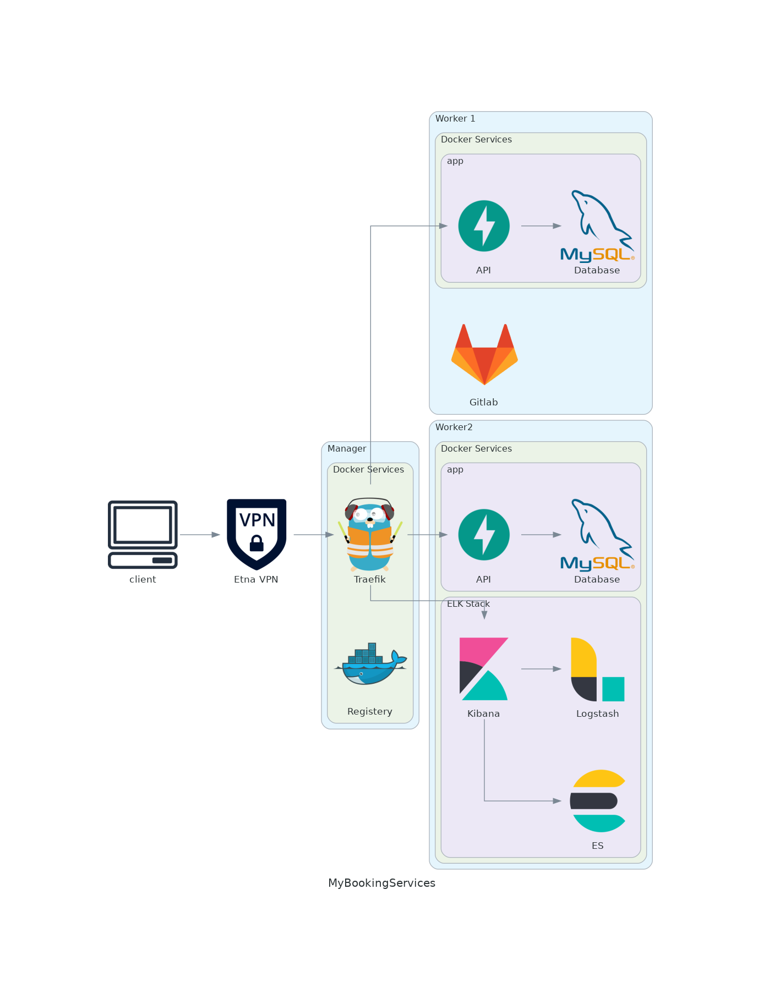

# MyBookingServices

Microservices infrastructure

### Services

| name      | vm       | IP              | Port |
|-----------|----------|-----------------|------|
| gitlab    | worker1  | 172.16.233.100  | 80
| registry  | manager  | 172.16.233.21   | 5000
| telegraf  | worker2  | 172.16.233.53   | 8888

### Architecture

